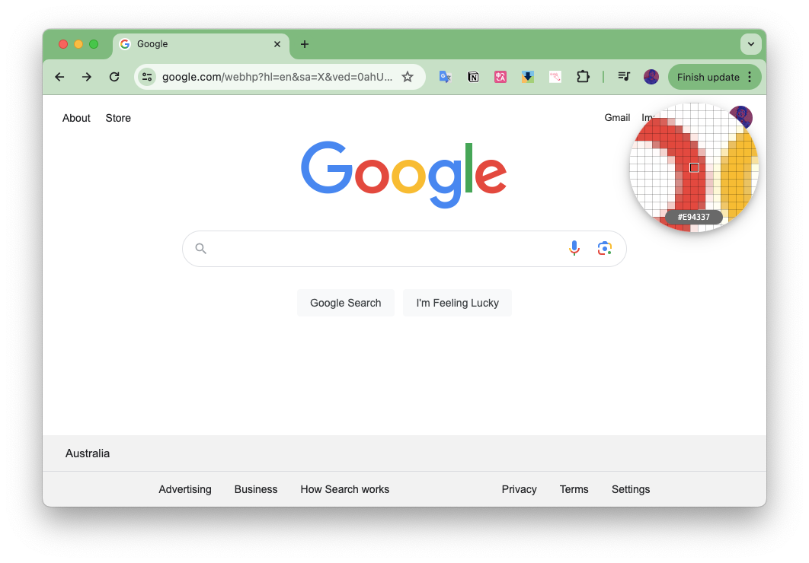

## color picker extesion

### Testing the extension

Follow the instructions to load an [unpacked extension](https://developer.chrome.com/docs/extensions/mv3/getstarted/development-basics/#load-unpacked).

It should look like this:

[Have a problem ?](https://github.com/shinelikeamillion/color_picker/issues).

[Give it a try]()